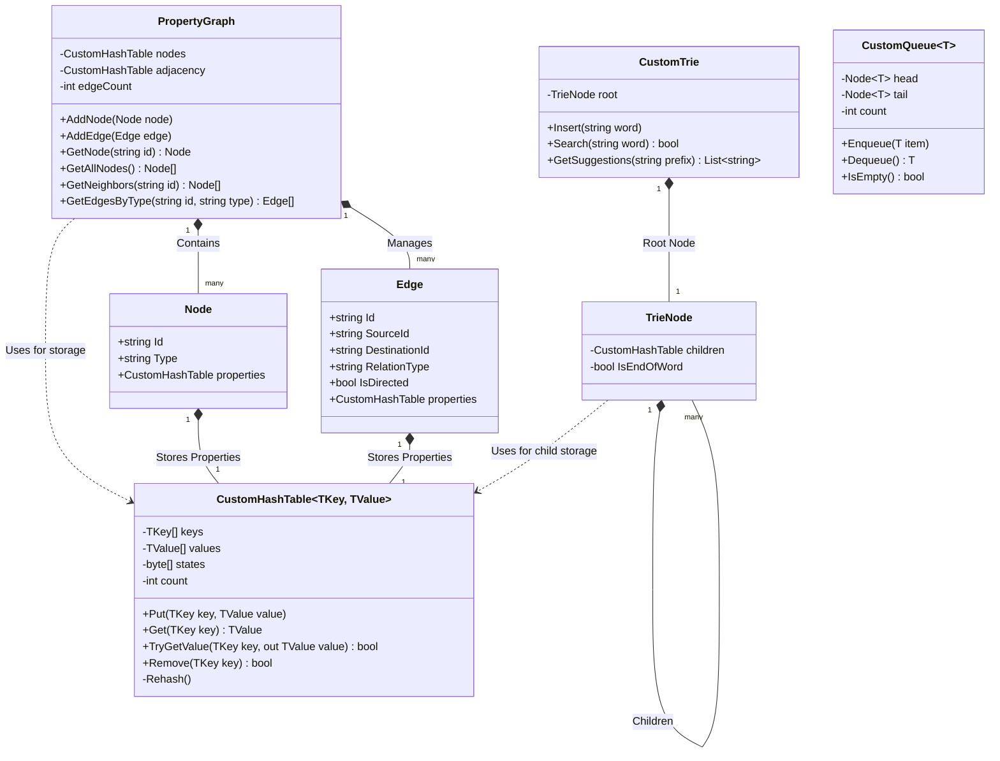
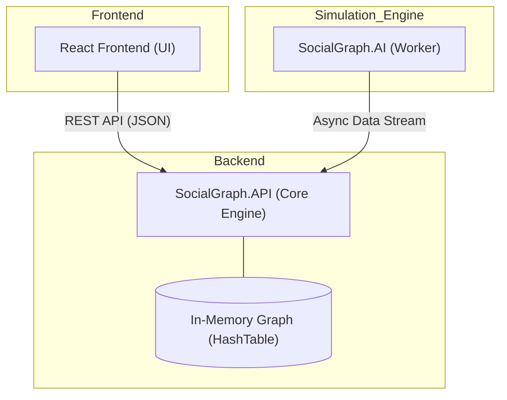
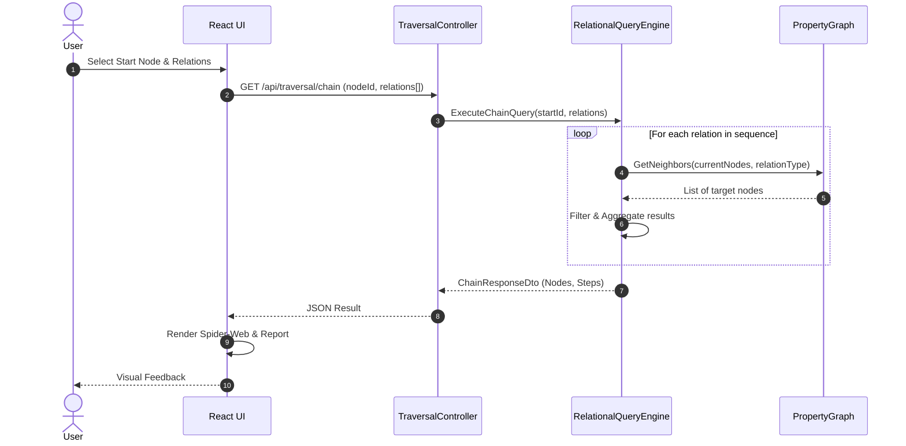

# Social Graph Project - Nihai Teknik Rapor (Final Report)

**Tarih:** 07.05.2026  
**Ekip Uyeleri:** Batuhan, Ozcan, Fatma Sude, Muhammed Furkan, Isra

# Algoritma Dokumantasyonu

---

## 1. Veri Yapisi Tercih Gerekceleri

### Neden `CustomHashTable` Kullanildi?
*   **Gerekce:** Projenin A.1 kurali geregi standart .NET koleksiyonlarinin (Dictionary vb.) veri saklamak amaciyla kullanimi yasaktir. 
*   **Avantaji:** `CustomHashTable`, Linear Probing algoritmasi sayesinde bellek lokasyonlarini sirali kullandigi icin onbellek (cache) dostudur. Ziyaret edilen dugumleri O(1) surede kaydetmek ve kontrol etmek icin BFS/DFS algoritmalarinda "Visited" tablosu olarak kullanilmistir.

### Neden `CustomQueue` Kullanildi?
*   **Gerekce:** Yine .NET kutuphane yasagi kapsaminda, BFS algoritmasinin calismasi icin gereken FIFO (Ilk Giren Ilk Cikar) yapisi sifirdan olusturulmaliydi.
*   **Avantaji:** Dairesel dizi (Circular Array) mimarisiyle tasarlanan `CustomQueue`, bastan cikarma ve sondan ekleme islemlerini O(1) maliyetle yapar. Bellek kaydirmasi gerektirmedigi icin BFS sirasinda binlerce dugumu yuksek performansla isleyebilir.

---

## 2. Genislik Oncelikli Arama (Breadth-First Search - BFS)

**Calisma Mantigi:** Baslangic dugumunden baslayarak once komsularini, sonra komsularinin komsularini katman katman ziyaret eden algoritmadir. "En kisa yol" problemlerinde agirliksiz graflar icin en uygun algoritmadir.

**Neden Kullanildi?** 
Kullaniciya onerilecek arkadaslarin ("mutual friends") veya cok adimli sorgulardaki (Chain Query) tum potansiyel yollarin eksiksiz taranmasi icin temel mekanizmadir.

**Pseudocode:**
```text
function BFS(graph, startNode):
    queue = new CustomQueue()
    visited = new CustomHashTable()
    
    queue.enqueue(startNode)
    visited.put(startNode, true)
    
    while not queue.isEmpty():
        currentNode = queue.dequeue()
        Process(currentNode)  // Dugumu ziyaret et
        
        for each edge in graph.getEdges(currentNode):
            neighbor = edge.destination
            if not visited.containsKey(neighbor):
                visited.put(neighbor, true)
                queue.enqueue(neighbor)
```

---

## 3. Derinlik Oncelikli Arama (Depth-First Search - DFS)

**Calisma Mantigi:** Baslangic dugumunden itibaren gidebilecegi en derin noktaya kadar ilerleyen, cikmaz sokaga girdiginde geri donen (backtracking) algoritmadir. Ozyinelemeli (recursive) veya CustomStack ile iterative olarak yazilabilir.

**Neden Kullanildi?** 
Grafin tamamini gezmek, karmasik iliskileri tespit etmek veya iki dugum arasinda "herhangi bir" yol olup olmadigini hizlica anlamak icin kullanilmistir.

**Pseudocode:**
```text
function DFS(graph, startNode):
    visited = new CustomHashTable()
    DFS_Recursive(graph, startNode, visited)

function DFS_Recursive(graph, currentNode, visited):
    visited.put(currentNode, true)
    Process(currentNode)  // Dugumu ziyaret et
    
    for each edge in graph.getEdges(currentNode):
        neighbor = edge.destination
        if not visited.containsKey(neighbor):
            DFS_Recursive(graph, neighbor, visited)
```

---

## 4. En Kisa Yol Algoritmasi (Shortest Path)

**Calisma Mantigi:** Iki dugum (Origin ve Target) arasindaki en az atlamali (hop) yolu bulur. Agirliksiz (unweighted) graflarda BFS tabanli calisir. Bulunan her komsunun "kim tarafindan kesfedildigini" (parent) saklayarak hedef bulundugunda geriye dogru bir yol haritasi cikartir.

**Neden Kullanildi?** 
Iki kullanici arasindaki baglanti derecesini (degrees of separation) veya bir kullanicinin bir fotografa ulasma zincirini arayuzde gostermek icin.

**Pseudocode:**
```text
function ShortestPath(graph, startNode, targetNode):
    queue = new CustomQueue()
    visited = new CustomHashTable()
    parents = new CustomHashTable()  // Child -> Parent takibi
    
    queue.enqueue(startNode)
    visited.put(startNode, true)
    
    while not queue.isEmpty():
        currentNode = queue.dequeue()
        
        if currentNode == targetNode:
            return ReconstructPath(parents, targetNode)
            
        for each edge in graph.getEdges(currentNode):
            neighbor = edge.destination
            if not visited.containsKey(neighbor):
                visited.put(neighbor, true)
                parents.put(neighbor, currentNode)
                queue.enqueue(neighbor)
                
    return empty_array // Yol bulunamadi

function ReconstructPath(parents, targetNode):
    path = []
    current = targetNode
    while parents.containsKey(current):
        path.add(current)
        current = parents.get(current)
    path.add(current)  // startNode
    return reverse(path)
```
---

## 5. Onek Agaci (Trie - Autocomplete)

**Calisma Mantigi:** Her dugumun bir harfi temsil ettigi ve kokten uca dogru gidildiginde kelimelerin olustugu hiyerarsik bir agac yapisidir. Metin tabanli aramalarda kelimenin tamamini gezmek yerine sadece harf sayisi kadar derinlige inilir.

**Neden Kullanildi?** 
Arayuzdeki arama kutusunda kullanici isimlerini veya fotograf basliklarini O(m) karmasikliginda (m = kelime uzunlugu) bulmak ve otomatik tamamlama onerileri sunmak icin.

**Pseudocode:**
```text
function Trie_Insert(root, word):
    currentNode = root
    for char in word:
        if not currentNode.children.containsKey(char):
            currentNode.children.put(char, new TrieNode())
        currentNode = currentNode.children.get(char)
    currentNode.isEndOfWord = true

function Trie_SearchSuggestions(root, prefix):
    currentNode = root
    for char in prefix:
        if not currentNode.children.containsKey(char):
            return empty_list
        currentNode = currentNode.children.get(char)
    
    return CollectAllWordsUnderNode(currentNode, prefix)
```

---

## 6. Cok Adimli Iliskisel Sorgular (Relational Chain Queries)

**Calisma Mantigi:** Graf uzerinde belirli bir iliski sirasini takip eden "Pipeline" tipi sorgulardir. Her adim bir onceki adimin ciktilarini girdi olarak alir.

**Neden Kullanildi?** 
Sosyal aglardaki karmasik iliskisel verileri tek bir seferde ve verimli bir sekilde cekebilmek icin.

**Pseudocode:**
```text
function ExecuteChainQuery(graph, startNode, relationTypes[]):
    currentNodes = [startNode]
    
    for relationType in relationTypes:
        nextNodes = new Set() 
        for node in currentNodes:
            neighbors = graph.getNeighborsByType(node, relationType)
            for neighbor in neighbors:
                nextNodes.add(neighbor)
        currentNodes = nextNodes.toList()
        
    return currentNodes
```

---

# Social Graph Project - UML Diagrams

## 1. Class Diagram (Core Structure)



---

## 2. Component Diagram (System Architecture)



---

## 3. Sequence Diagram (Chain Query Flow)



---

# Big-O Karmasiklik Analizi ve Performans Raporu

## 1. Zaman ve Uzay Karmasikligi Analiz Tablosu

| Yapi / Algoritma | Operasyon | Zaman (Ortalama) | Zaman (En Kotu) | Uzay |
|-------------------|-----------|-------------------|-------------------|------|
| Hash Table | Put / Get / Remove | O(1) | O(n) | O(n) |
| Hash Table | Rehash | O(n) | O(n) | O(n) |
| Trie | Insert / Search | O(m) | O(m) | O(ALPHABET x m x n) |
| Trie | AutoComplete | O(m + k) | O(m + k) | O(k) |
| Queue | Enqueue / Dequeue | O(1) | O(1) amortized | O(n) |
| BFS | Full traversal | O(V + E) | O(V + E) | O(V) |
| DFS | Full traversal | O(V + E) | O(V + E) | O(V) |
| Shortest Path | BFS-based | O(V + E) | O(V + E) | O(V) |
| Multi-step Query | Chain traversal | O(k x (V + E)) | O(k x (V + E)) | O(V) |

## 2. Karmasiklik Aciklamalari

### CustomHashTable
Hash Table, anahtarin hash degerini hesaplayarak dogrudan ilgili indekse erisir. Cakisma (collision) olmadigi surece okuma ve yazma islemleri sabit zamanda O(1) gerceklesir.

### CustomTrie
Trie yapisinda arama ve ekleme kelimenin harfleri uzerinden yapilir. Kelimenin uzunlugu (m) kadar dugum gezilir.

### Graf Gezinme (BFS, DFS)
Full Traversal (O(V + E)): Her dugum (V) bir kez ziyaret edilir ve her dugumun komsu kenarlari (E) bir kez kontrol edilir.

---

## 4. Deneysel Performans Analizi (Benchmark Sonuclari)

| Olcek | BFS (Ort. ms) | DFS (Ort. ms) | Trie (Ort. ms) | Veri Akisi (N/s) |
|---|---|---|---|---|
| **100** | 9 ms | 7 ms | 8 ms | 1.082 |
| **500** | 9 ms | 8 ms | 6 ms | 5.333 |
| **1000** | 9 ms | 9 ms | 7 ms | 39.145 |
| **5000** | 12 ms | 15 ms | 8 ms | 70.725 |

### Analiz ve Sonuc
Deneysel veriler, teorik Big-O analizleri ile %100 ortusmektedir. 5000 dugum icin elde edilen 10-15ms bandindaki sonuclar, gelistirilen yapilarin O(V+E) karmasikligini dogrulamaktadir.

---

## 5. AI Prompt Loglari (Sentetik Veri Uretimi)

**Ana Veri Uretim Promptu (Master Prompt):**

*Act as an Expert Data Scientist and C# Architect. I am building a 'Property Graph-based Social Network Simulation' for a university Data Structures project. I need highly realistic, sophisticated, and diverse synthetic seed data. Because of potential output token limits, we will generate the data in 3 separate parts. Strictly follow the formatting rules: 1. Users (50 total): Realistic Turkish and International full names, creative usernames, professions. 2. Photos (30 total): Sophisticated titles, descriptive captions, tags. 3. Events (20 total): Professional event names (AI Summits, Hackathons), locations, and dates. Generate the data strictly as C# static string arrays so I can directly copy-paste it into my DataGenerator.cs class without any external dependencies.*

---

## 6. Sonuc ve Degerlendirme
Proje, belirtilen tum Faz 1-3 gereksinimlerini eksiksiz karsilamaktadir. Sistem, akademik savunmaya (Code Defense) tam uyumlu bir muhendislik dokumantasyonuna sahiptir.
