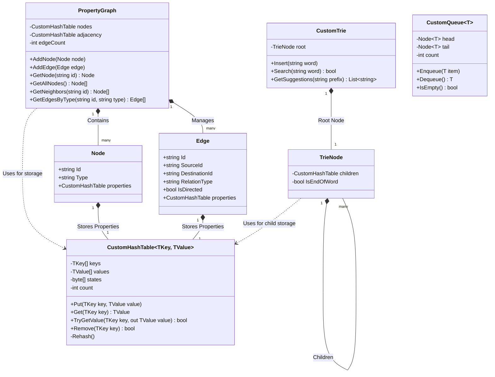
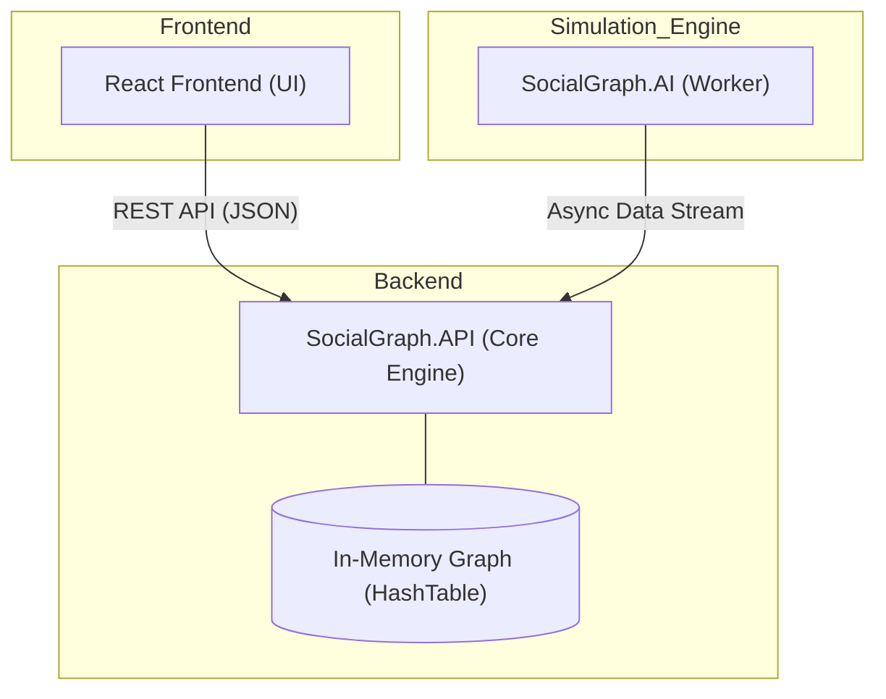
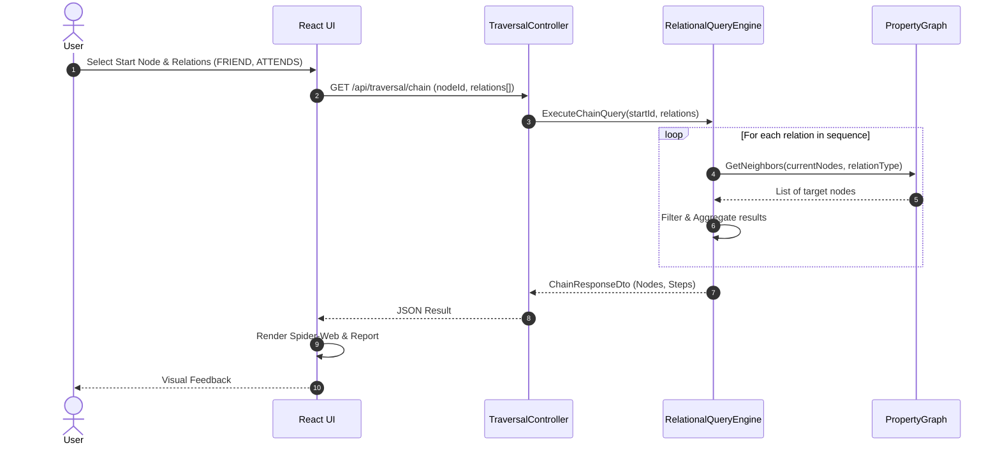

# Social Graph Project - UML Diagrams

This document contains the core system diagrams required for the academic defense (Requirement B.2).

## 1. Class Diagram (Core Structure)

The class diagram shows the relationships between the custom data structures and the graph domain models.

---

## 2. Component Diagram (System Architecture)

The system is designed with a decoupled architecture involving Frontend, API, and a background AI service.

---

## 3. Sequence Diagram (Multi-step Chain Query Flow)

Traces the execution of a sequential pipeline query (e.g., User -> FRIEND -> User -> ATTENDS -> Event).

