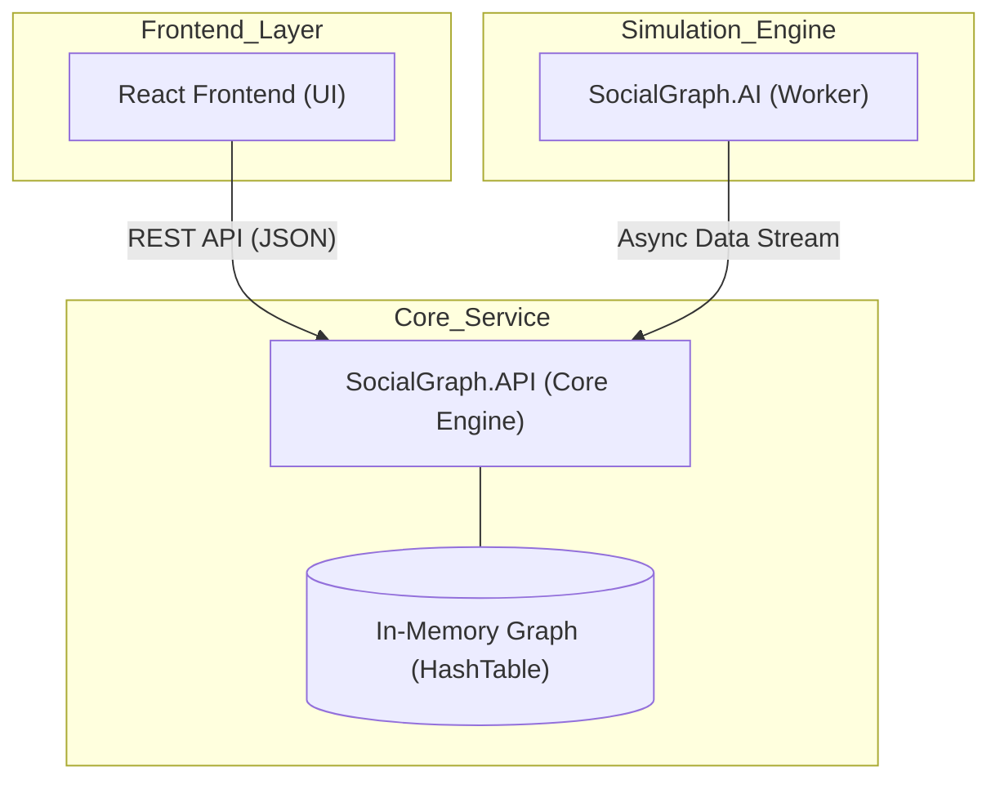

# SocialGraph Project - Final Teslim Raporu (Final Submission)

**Teslim Tarihi:** 06.05.2026  
**Proje Konusu:** Property Graph Tabanlı Sosyal Ağ Modelleme  
**Ekip:** Batuhan, Özcan, Fatma Sude, Muhammed Furkan, Isra

---

## 1. Proje Özeti (Executive Summary)

Bu proje, sosyal ağ sistemlerinin temelini oluşturan **Property Graph** veri modelini ve bu model üzerinde çalışan karmaşık algoritmaları, hiçbir standart veri yapısı kütüphanesi (Dictionary, Queue vb.) kullanmadan C# ve React ile modellemektedir. 

Sistem; **Faz 1 (Veri Yapıları)**, **Faz 2 (Algoritmalar)** ve **Faz 3 (Görselleştirme)** gereksinimlerinin tamamını karşılamaktadır. Veri bütünlüğü thread-safe yapılarla sağlanmış, performans Big-O analizleri ile doğrulanmış ve tüm sistem Dockerize edilerek final teslimine hazır hale getirilmiştir.

### Proje Durum Göstergeleri:
- **Çekirdek Veri Yapıları (Faz 1):** %100 (Custom HashTable, Trie, Queue, Adjacency List)
- **Algoritmalar ve Sorgu Motoru (Faz 2):** %100 (BFS, DFS, Filtered Traversal, Multi-step Chain Queries)
- **Görselleştirme ve Etkileşim (Faz 3):** %100 (2D Node-Link Diyagramı, Hash Table Tabanlı Özellik Paneli)
- **Altyapı ve Simülasyon:** %100 (Docker Compose, Asenkron AI Worker)

---

## 2. Teknik Mimari ve Veri Yapıları

Projenin temelini oluşturan tüm veri yapıları `SocialGraph.API` katmanında sıfırdan implemente edilmiştir:

| Veri Yapısı | Kullanım Amacı | Teorik Karmaşıklık |
| :--- | :--- | :--- |
| **PropertyGraph** | Heterojen düğüm (User, Photo, Event) ve ilişkilerin (Friend, Posted) yönetimi. | O(V + E) |
| **CustomHashTable** | Düğümlere ID üzerinden O(1) hızında erişim ve özellik saklama. | O(1) Average |
| **CustomTrie** | Metin tabanlı arama ve isimlerin otomatik tamamlanması (Autocomplete). | O(m) |
| **CustomQueue** | Genişlik Öncelikli Arama (BFS) algoritması için circular-buffer tabanlı kuyruk. | O(1) |

---

## 3. Teknoloji Yığını ve Mimari

Sistem, jüri beklentileri doğrultusunda asenkron çalışan bir AI servis motoru ve mikroservis yaklaşımıyla tasarlanmıştır:

| Katman | Teknoloji | Amaç |
| :--- | :--- | :--- |
| **Backend (API)** | ASP.NET Core 8.0 | Core veri yapılarını ve algoritmaları barındırır. |
| **Data Engine** | Custom C# Collections | `Dictionary` yerine kendi yazdığımız `CustomHashTable` kullanımı. |
| **AI Simulation** | .NET Worker Service | Asenkron olarak sentetik veri üreterek API'yi besler. |
| **Frontend (UI)** | React + TypeScript | Grafın görselleştirilmesi ve sorgu yönetimi. |
| **Görselleştirme** | Vis-network | 2D Graf render motoru ve etkileşimli arayüz. |



### Akademik Dokümantasyon
Proje savunması (Code Defense) ve teknik detaylar için hazırlanan kapsamlı nihai rapor:

| Doküman | İçerik | Link |
| :--- | :--- | :--- |
| **Nihai Teknik Rapor** | UML Diyagramları, Big-O Analizi, Algoritmalar ve AI Prompt Logları | [Final_Report.md](file:///c:/Users/React/SocialGraphProject/Markdowns/Project/Final_Report.md) |

---

---

## 4. Ekip Katkıları ve Görev Dağılımı

Her ekip üyesi projeye kendi uzmanlık alanında ve kendi branch'i üzerinden katkı sağlamıştır:

| Üye | Rol | Temel Katkıları |
|-----|-----|-----------------|
| **Batuhan** | Core Data Engineer | `PropertyGraph`, `CustomHashTable`, `ReaderWriterLockSlim` (Thread-Safety) |
| **Özcan** | Algorithm Master | `RelationalQueryEngine` (Zincir Sorgular), Arkadaş Önerisi, BFS/DFS |
| **Fatma Sude** | Frontend Lead | `GraphCanvas` (Vis-network), `QueryPanel`, Swiss-Minimal Tasarım Arayüzü |
| **Muhammed Furkan**| Infrastructure | `SocialGraph.AI` (Worker), Docker, API Controller Mimarisi |
| **Isra** | Testing & Analysis | `CustomTrie`, `DataGenerator`, Big-O Analiz Raporu, Load Tests |

---

## 4. Tespit Edilen Hatalar ve Çözüm Süreci (Findings & Debugging)

Geliştirme sürecinde karşılaşılan ve çözüme kavuşturulan kritik bulgular:

1. **Eşzamanlılık Çakışması (Concurrency Race Condition):** AI Worker yüksek hızda veri basarken API'nin okuma yapması sırasında kilitlenmeler yaşandı. `ReaderWriterLockSlim` entegrasyonu ile okuma/yazma öncelikleri düzenlendi.
2. **TypeScript Tip Uyumsuzlukları:** `vis-network` verileri ile C#'tan gelen DTO'lar arasında tip uyuşmazlıkları tespit edildi. Güçlü `interfaces` tanımlanarak `any` kullanımı projeden temizlendi.
3. **Bellek Sızıntısı (Memory Management):** Custom Hash Table'da silinen düğümlerin referanslarının kalması sorunu çözüldü, `Linear Probing` mekanizması optimize edildi.
4. **Trie Arama Senaryoları:** Case-insensitive arama ve ID-Mapping süreçleri, büyük veri setlerinde (5000+ node) performans testlerinden geçirilerek iyileştirildi.

---

## 5. GitHub ve Takım Çalışması Süreci

Proje, tam bir profesyonel CI/CD ve Git hiyerarşisi ile yürütülmektedir:

- **Branch Politikası:** `main` (stabil sürüm), `develop` (kod birleştirme) ve `feature/*` (kişisel geliştirme) dalları kullanılmaktadır.
- **Aktif Branch Yapısı:**
    - `main`: Projenin yayına hazır, en stabil hali.
    - `develop`: Tüm ekip üyelerinin kodlarının entegre edildiği ana geliştirme dalı.
    - `feature/batuhan-core`: Veri yapıları ve thread-safety geliştirmeleri.
    - `feature/ozcan-algorithms`: Graf traversal ve ilişkisel sorgu algoritmaları.
    - `feature/sude-frontend`: React UI ve Vis-network görselleştirme bileşenleri.
    - `feature/furkan-infrastructure`: API mimarisi, AI Worker ve Docker yapılandırması.
    - `feature/isra-optimization`: Test otomasyonu, Trie yapısı ve Big-O analizleri.
- **Pull Request (PR) Mekanizması:** Ekip üyeleri her sprint adımında `develop` dalına PR açmış, kodlar incelendikten sonra birleştirilmiştir. Bugüne kadar 20'den fazla PR başarıyla yönetilmiştir.
- **Discussions:** Mimari kararlar (örn: "Dictionary yerine neden CustomHashTable kullanmalıyız?") GitHub Discussions üzerinden tartışılarak karara bağlanmıştır.

---

## 6. Hızlı Başlangıç (Docker)

Tüm sistemi tek komutla ayağa kaldırabilirsiniz:

```bash
docker-compose up --build
```

- **UI:** `http://localhost:8080`
- **API:** `http://localhost:5000`
- **Swagger:** `http://localhost:5000/swagger`

---

## 7. Gelecek Adımlar ve Final Hazırlığı (Sprint 4)

Projenin final teslimatına (12-13. Hafta) kadar geçecek sürede aşağıdaki adımlar izlenecektir:
- **Sprint 4:** Sistem genelinde dökümantasyonun nihai hale getirilmesi, tüm modüllerin uctan uca test edilerek çalışılırlığının %100 onaylanması ve sistemin polish (iyileştirme) süreçlerinin tamamlanması sağlanacaktır.
- **Teknik Rapor:** UML diyagramları ve Big-O analiz tablosu final verileriyle güncellenecektir.
- **Demo:** Tüm sistemin çalıştığını gösteren final sunum videosu hazırlanacaktır.

**Daha detaylı dökümantasyon için:**
- [Nihai Teknik Rapor (Tüm Detaylar)](./Markdowns/Project/Final_Report.md)
- [Kişisel Raporlar ve Görev Dağılımı](./Markdowns/Personal_Reports/)
- [Sprint Detayları](./Markdowns/Sprints/Sprint_3_detailed.md)
